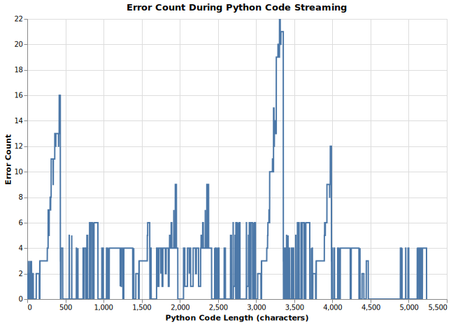

<!-- Introduction: -->
# Introduction

* .txt discusses an interesting technique for forcing valid outputs to be generated by LLM's in [How fast can grammar-structured generation be?](https://blog.dottxt.co/how-fast-cfg.html)
- I don't have good enough computers to manipulate the output layer, so I'm stuck with OpenAI API compatible solutions.
* This blog outlines some of my thoughts and observations while guiding Cline through development of [this experiment](https://github.com/ConradMearns/pocket_parsing).
- Most of this document is an afterthought - I hope to clarify this process for myself more as I go on.


<!-- Motivation: -->
# Motivation
* Cline and other Agentic coding models are likely to stick around, even without any significant advances in LLM performance.


<!--
Loose IBIS notation

`#` heading 1 for hypothesis statement
`*` unordered list for actions taken / position
`-` unordered list for negative observations
`+` unordered list for positive observations
`>` Block-quote for an aside, or comment. A distraction. Start a new file to investigate?
-->

---

<!-- Hypothesis: -->
# Can we parse the code output of an LLM agent while it's streaming to validate correctness closer to real-time?

<!-- Actions: -->
* Started with Pocketflow Streaming with Interrupt Example
* Added tree-sitter-python
* Modified StreamNode to feed characters into accumulator for iterative validation

<!-- Observations: -->
- Incremental parsing triggers errors too early
    Found that when we trigger an interrupt whenever a parsing error is detected, certain codes with error when maybe they should not.

    ```python
    x = 42
    ```

    This will error, because as it flows through the system, at some point we will only have

    ```python
    x = 
    ```

    Which is not valid python. The behavior of our system is correct - but our assumptions about the problem are not.

<!-- Hypothesis: -->
# Can we mitigate [[- Incremental parsing triggers errors too early|this behavior]] by counting errors over time?

For example, when an erroneous error like this is detected, it is likely to be resolved soon. When resolved, the error count will go back to 0. Perhaps an error threshold will work because when errors arise, if they are erroneous they will disappear before many errors accumulate.

* Added the error accumulator.
- Still had problems after 5 errors were detected
* Increased threshold to 300.
* Added feature to print error count continuously for more observations.
- Many, many errors. Decided to change approach.
* Added new tool to plot AST errors as a text is incrementally parsed character by character.
    
    Ingest and plot plot.py to see how AST errors accumulate and resolve over time. plot.py contains no syntax errors, as it was used to produce it's own plot.

    

    > A cool plotting tool for demonstrating this would be to show the text side by side with the chart and present a slider.
    > As the slider spans from 0 to the EOF, you could print the text, AST, and graph. 
   

* The spikes in error counts are likely from multi-line text blocks.
- This is just how Tree-sitter works.
    We probably need to use something else that handles incremental parsing differently.
    Ideally, we need a system that knows the difference between a parsing error, and a syntax error that occurs from out-of-language tokens.

# Could [lark](https://github.com/lark-parser/lark/tree/master) work for incremental parsing?

* Create small_lark.py for testing.
+ Expected tokens are listed in the exception, so we can detect errors that end-of-input related or not.
- Not perfect, `Example: x = 42` passes.
- `def x():\n\ta=1` fails
* Added more newline's to the lark examples - they seem to work as expected now.

---

There's some useful potential for wrapping parsers directly around streamed outputs for better evaluation. Usually, Cline just makes a best attempt and then fails, executes the bad code, and parses the errors. This is not the direction I take as a programmer.

Documentation access is also usually ignored as a step - both by Cline and the model itself (even when documentation is explicitly provided)