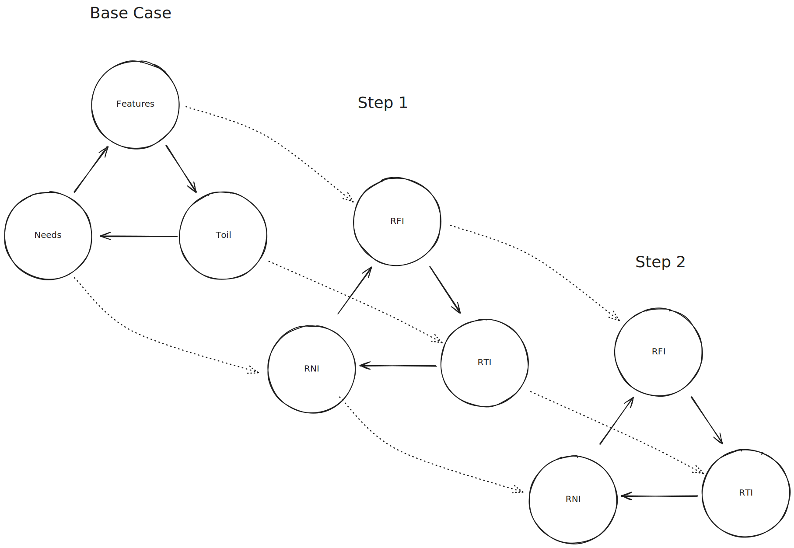

Many years ago I ran into the wikipedia article for [Issue-Based information systems](wikipedia.org/Issue-based_information_system) - a technical approach for "clarifying" wicked problems.

I found the concept appealing because of it's simple schema, and it's imaginary promise - salvation from the hell which is my sprawling notes.

Like many during the pandemic, I got sucked into Note Taking Optimization twitter. I was an early user of Roam Research, and evangelical supporter of Obsidian. As more and more technology was produced, I thought that _maybe_ - just _maybe_ - Ted Nelsons visions for a transcludable and intertwingled web could come true.

It hasn't, still.

I fell victim to the mentality that "Notes are like Gardens" - and started to systematically comb through my 800,000 words of Obsidian notes to pull weeds, created links, and establish order. The emotional toll of the labor culminated in a note-taking burnout that has persisted for years now.

I don't write in Obsidian anymore. The curse of Xanadu maybe lives on ?

And in my mind this little triangle has circled my thoughts and laughed in the corner of my mind like a small demon - or goblin or faerie.

Live moves on though, and the flow of information to and from me via work never stops - so I went back to paper. I order a giant pile of blank notebooks from Amazon so that I could experiment for cheaper, faster, and with less sentimentality. I started tearing, folding, scribbling, and burning as I pleased.

I was free from YAML frontmatters, schemas, and requirements and god fucking damn it felt nice.

Of course, there was plenty that I lost. It's not so simply to share information from a notebook - but then again did I share my Obsidian notes? Did I publish all of those half-backed ideas and scribbles of thoughts? No, of course I didn't.

---

I've now built a system that seems to work well on paper, works well for my mind and memory, and respects my requirements. It creates space for me to think and understand problems - and track the mutlifaceted work that comes to me in all of it's various cadences.

I'll share more about the system once I've lived with it longer.

Essentially - after I discovered the House of Quality tool for mapping product feature importance, I pushed just a little farther and came up with a system that I think can replace the dream of an IBIS system for personal development.

The House of Quality maps "User Needs" to "Features"  - I've expanded the term for Feature to mena "Solution".

In IBIS - perhaps Needs and Features map to Issues and Positions respectively.
"Pros" and "Cons" never clicked for me though - in theory it makes sense and is easy to simply write out.
However in practice, they turn into a mess. Often, the system of Pros and Cons never helped me to prioritize, distill, or break complex issues apart. They made Wicked Problems visible - but not less Wicked.

So what to do instead? Start with Needs and Solutions.
Instead of mapping their relationships with a tree structure - write them as seperate lists.
Then, compile a matrix of Needs vs Solutions, just like the House of Quality. Keep most entries NULL or '0' and then add a negative or positive value to express relational strength.
This now allows for more than just branched ideas - it allows for Solutions to "resolve" multiple needs, or express that 1 solution can solve one need but hinder another.

I fell in love with this - but I had another problem. In OG House of Quality, they use User Interviews and Feedback to determine the Voice of the Customer priorities - effectively a priority score for each Need.

I decided that I could probably calculate this value for myself by adding a new dimension to my House of Quality: Pain.

By recording my frustrations, pain points, errors, or complaints in a new list - I can use my exsiting Needs list and make a new matrix.
How related is this Problem to this Need?

For example - if I'm complaining about Decision Fatigue, there are many things I could Want or Needs that reflect how I could help.
All the while - I am keeping the concept of the specific solution out of the way of what I need. If I have decision fatigue, I probably don't care about a specific solution yet becaue I don't know if the solution will affect my actual need.

So - once I have a matrix of Problems and Needs I can assign relevancy scores. The sum and normalization of the need columns then inform me of my most important needs - based on my problems.

I can then scale the relative scale of Need to Solution relations by the results from the previous matrix.

The result? A priority list of what solutions I should be focused on.
All opinions are quantized and captured in relationships in a way that feels more fair, more open, and more expressive.

There's still some other features I'm missing so far:

- If we consider Needs to Problems or Solutions to Needs as a A to B mapping - we also may gain insight from A to A mappings, like in the House of Quality.
- Since we've added a new dimension of Needs and Problems - the next natural question is how many Dimensions _can_ we add while still enhancing our model? I'm primarily interested in Solutions to Problems maps now. What would happen if we find our Most Important Solutions start causing the Most Pain? And if we build an engine that passes new scaled Pain values to the next matrix, then the next matrix, etc - what kind's of stories might this illuminate?

---

Didn't explain IBIS is tree based - and that this may actually be an issue. It's hard to use, map, and organize. It also doesn't allow for re-use and cyclical dependencies that are probably realistic

