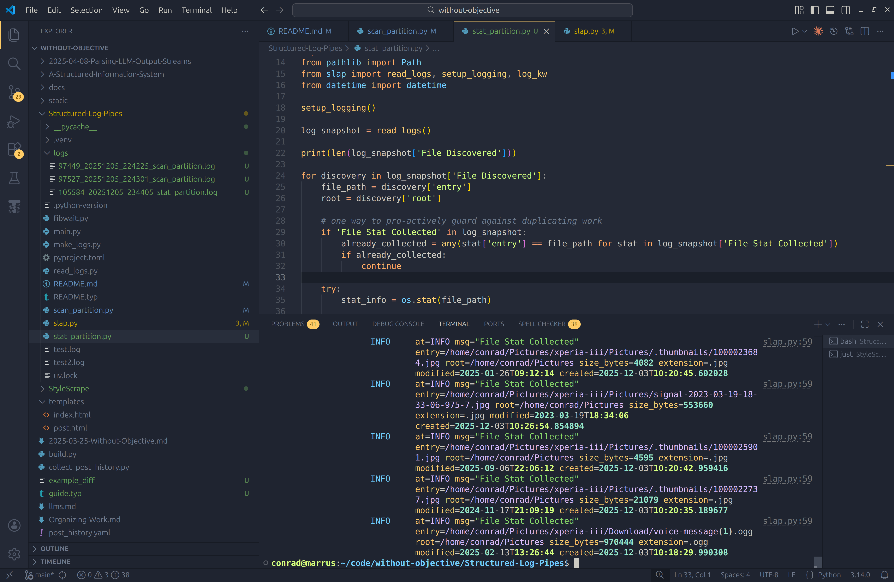

> AI Use Preface:
> I care more about sharing the idea than being a perfect writer - so parts of this article are AI generated.
> You can pm.me hate mail @ to my email address roncad
> Claude helped me write the introductory text here.
> I wrapped what Claude wrote in `<claude>` and `</claude>` tags for honest provenance.
> I may edit the text Claude produces - but will keep the tags. 
> Everything outside of the tags is my own.


# The UNIX Philosophy

> This is the Unix philosophy: 
> Write programs that do one thing and do it well. 
> Write programs to work together. 
> Write programs to handle text streams, because that is a universal interface.
> - Doug McIlroy (2003). The Art of Unix Programming: Basics of the Unix Philosophy

`<claude Read @README.md - help me expand on these ideas. What is the main benefit and reasoning behind the UNIX philosophy of writing small single purpose scripts? Where does this fall apart? and why isn't it a good solution / used more broadly? Does this new approach help to solve any of these problems?>`

The UNIX philosophy's main benefits:
- **Composability**: Small tools can be combined in unexpected ways
- **Simplicity**: Each program has a single, clear purpose
- **Reusability**: Tools can be reused across different contexts
- **Debuggability**: Easy to test individual components
- **Flexibility**: Combine tools without rewriting them

# Where UNIX Pipes Fall Apart

Despite their elegance, UNIX pipes have fundamental limitations that prevent broader adoption:

## 1. **Unstructured Text is Brittle**
- Parsing text output (awk, sed, cut) is fragile and error-prone
- No schemas or types—breaking changes are silent
- Whitespace, quotes, and special characters cause endless edge cases

## 2. **Limited Flow Control**
- Linear pipelines only—no branching, fan-out, or fan-in
- Can't easily send output to multiple consumers
- No built-in support for conditional routing

## 3. **Poor Error Handling**
- Exit codes are the only signal (0 or non-zero)
- Error messages go to stderr (unstructured text again)
- Hard to propagate context about what failed and why

## 4. **No State Management**
- Each process is isolated—can't share state without external tools
- No reactivity—can't respond to events or build feedback loops
- Difficult to build stateful, long-running processes

## 5. **Limited Observability**
- Hard to debug multi-stage pipelines
- No structured logging by default
- Can't easily trace data flow through the system

This is why UNIX pipes work great for simple scripts but struggle in 'enterprise' software where you need:
- Reactive, event-driven systems
- Complex branching logic
- Structured logging and observability
- Type safety and validation
- Scalable, long-running processes

# The Solution: Structured Log Pipes

What if we kept the UNIX philosophy of composability but fixed the interface?

**Key insight**: Replace unstructured text with JSONL (JSON Lines)

## Benefits Over Traditional UNIX Pipes

1. **Structured Data**: Type-safe events with schemas (via dataclasses)
2. **Maintains Composability**: Still uses stdin/stdout—works with existing UNIX tools
3. **Better Debugging**: JSON is human-readable and machine-parseable
4. **Foundation for Reactivity**: Structured events enable event-driven patterns
5. **Language Agnostic**: Any language can emit/consume JSONL
6. **Incremental Adoption**: Works alongside existing text-based tools

`</claude>`

## Current Features

- JSONL stdout for structured event emission
- Type-safe event parsing (Python dataclasses)
- Composable via UNIX pipes

<!-- # Features -->
# Piping structured data in and out of `fibwait.py`

I made `fibwait.py` to illustrate the concept - roughed out but works.

```bash
without-objective/Structured-Log-Pipes$ ./fibwait.py 
# {"a": 1, "b": 2}
without-objective/Structured-Log-Pipes$ ./fibwait.py | ./fibwait.py 
# {"a": 2, "b": 3}
without-objective/Structured-Log-Pipes$ ./fibwait.py | ./fibwait.py | ./fibwait.py
# {"a": 3, "b": 5}
without-objective/Structured-Log-Pipes$ 
```

The main idea here would be to do all sorts of complex Side-Effect driving work, and then wrap that work in Structured Logging _as we should anyway_.
Then, this can be used to control scripts down the line - or simply produce a log of work completed.

## Problems with 

> P: JSONL does look ugly though, it would be nice to have a Logging Format that is slightly more human readable that works for this.

`logfmt` is _an_ alternative - I wont say better but it does at least have good support and colored formatting.

> P: The stdin parsing system inside fibwait sucks though, we can't really expect people to write this themselves.

> P: fibwait is a bad example.

> P: Since I'm introducing libraries in scripts - are we just going to expect users to make a venv compatible with new libraries I need??

## New Requirements

> N: Need at a utility file to capture the complexities we are introducing to make this easy to use - otherwise it's too much effort

> N: Let's make a simple Content Addressable Storage example instead of fibwait

A very nice feature I hadn't thought about until now -
because we are relying on logging, we can write to stdout _and_ file pretty easily.

> N: If we are writing to logfiles, how do we handle parallel processes?

> F: Slapping a PID to the filename has been good enough so far -
> treating 'logs' as a collection also helps. _Expect_ that querying is the interface

# A Better Example - Simple Content Addressable Storage ETL
<!-- # Features -->

## Effectual Scripting: Partition Scanning


Firstly, I just learned that [UV allows dependencies to be declared in situ](https://docs.astral.sh/uv/guides/scripts/#declaring-script-dependencies)
and this is easily the coolest and most needed technologies ever.

Let's make a simple `ls` replacement using structured logging:

```bash
chmod +x scan_partition.py
uv add --script scan_partition.py pandas
```

```python
#!/usr/bin/env -S uv run --script

# /// script
# requires-python = ">=3.14"
# dependencies = [
#     "logfmter",
#     "pandas",
#     "rich",
# ]
# ///

import os
from pathlib import Path
from slap import setup_logging, log_kw

setup_logging()

root_directory = Path("~/Pictures/").expanduser().as_posix()

for root, _, files in os.walk(root_directory):
    for file in files:
        file_path = os.path.join(root, file)
        log_kw("File Discovered", entry=file_path, root=root_directory)
```

The script is simple - and mostly relies on outsourcing our logging to the `slap` file - which handles saving to file as well now.

This allows us to make a _very_ rudimentary event sourcing log.

Obviously - these can't be used _quite_ like an event sourcing database.
We can re-run this script over and over again - only to find it reproducing events that exist in older files.
Events in this log are not idempotent - and this is fine.

We're looking for something easy after all - but consider what this gives us:

When we build a more complex ETL pipeline, we are automatically saving a context of work accomplished. If we get smart about querying this data, we can automate some of the control plane without having to define additional files and filetypes.

Let's continue this pipeline to see what I mean (because I don't know the answer yet either).

I have copied all of the photos off of my phone and put them on this laptop to scan. I want to upload them to a Content Addressable Storage, and collect some information about what I have so that I can make predictions about future work.

My Operating System and File System knows what files exist - but I don't.
To solve for this, we introduced a simple `ls` replacement. 
This scans our files and dumps what we learn into a myriad of logfiles.

We want to use these logfiles to schedule new work - so first let's think about the work we want to do:

1. How much data do I have? Based on file sizes, is there anything surprising?
2. How many unique file types are there? I know I have a lot of images and some video. What about PDF's and DOCX?
3. How many duplicate files do I have? Hopefully not many - but we can hash our data and find out.
4. 'Uploading' the data is likely going to be error prone - simply because I'm on a laptop, the process will be long, and I might forget to plug my laptop back in while it processes. Before you comment to suggest I do something else - imagine being a company running a similar process at scale when boom - Cloudflare, AWS, or Starlink go down. Can you're software handle the inevitable failures of the infrastructure surrounding it?

To start - let's acquire some initial info. I ran the `scan_partition.py` script twice and killed it early both times to ensure I had some duplicate events in my `logs/` folder - and that everything is working. 
I'll commit those logs - idk about the rest yet.

We'll make a new tiny script called `stat_partition.py` and set it up similarly.
We'll also add some magic to `slap.py` so that we can read in these logs and deduplicate them for reading.

```python
#!/usr/bin/env -S uv run --script

# /// script
# requires-python = ">=3.14"
# dependencies = [
#     "logfmter",
#     "logfmt",
#     "pandas",
#     "rich",
# ]
# ///

import os
from pathlib import Path
from slap import read_logs, setup_logging, log_kw
from datetime import datetime

setup_logging()

log_snapshot = read_logs()

print(len(log_snapshot['File Discovered']))

for discovery in log_snapshot['File Discovered']:
    file_path = discovery['entry']
    root = discovery['root']

    # one way to pro-actively guard against duplicating work
    if 'File Stat Collected' in log_snapshot:
        already_collected = any(stat['entry'] == file_path for stat in log_snapshot['File Stat Collected'])
        if already_collected:
            continue

    try:
        stat_info = os.stat(file_path)

        file_size = stat_info.st_size
        modified_time = datetime.fromtimestamp(stat_info.st_mtime).isoformat()
        created_time = datetime.fromtimestamp(stat_info.st_ctime).isoformat()
        file_ext = Path(file_path).suffix.lower()

        log_kw(
            "File Stat Collected",
            entry=file_path,
            root=root,
            size_bytes=file_size,
            extension=file_ext,
            modified=modified_time,
            created=created_time,
        )
    except (OSError, PermissionError) as e:
        log_kw("File Stat Error", entry=file_path, error=str(e))
```

The cool bit here is that we can query our logs to determine if we want to re-do work again or not.




---

- [x] ls
- [ ] stat
- [ ] hash
- [ ] 'upload'

---

https://pages.cs.wisc.edu/~remzi/Naur.pdf
https://www.arthropod.software/p/vibe-coding-our-way-to-disaster